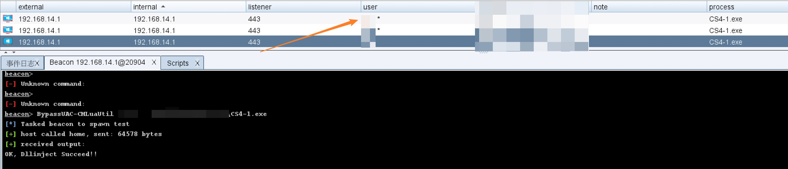

# 插件介绍
----

该插件主要包括各种提权、ByPassUAC等功能。使用cobaltstrike加载ele.cna，并确保cna与dll文件在同一目录下，否则需要修改脚本的dll路径。

# 功能模块
----

使用时只需要在后面跟上运行文件的路径，即可实现提权/BypassUAC运行文件.
提权脚本针对不同系统版本请使用不同的模块，BypassUAC挑了几个可以通杀，影响较小的方式。

|     |     |     |
| --- | --- | --- |
| 类型  | 功能名称 | 使用示例 |
| 提权  | PrintSpoofer提权，建议win7以上使用 | PipePotato  C:\\temp\\1.exe |
| 提权  | RasmanPotato提权 | RasmanPotato C:\\temp\\1.exe |
| 提权  | Win32k CVE-2019-0808提权，建议win7使用 | CVE-2019-0808 C:\\temp\\1.exe |
| BypassUAC | com组件CMLuaUtil  bypassuac | BypassUAC-CMLuaUtil C:\\temp\\1.exe |
| BypassUAC | 通过fodhelper和computerdefault使用注册表bypassuac | BypassUAC-ShellRegMod C:\\temp\\1.exe |
| BypassUAC | 通过slui和sdclt使用注册表bypassuac | BypassUAC-ShellRegMod2 C:\\temp\\1.exe |
| BypassUAC | 和BypassUAC-ShellRegMod类似 | BypassUAC-ShellRegMod3 C:\\temp\\1.exe |
| BypassUAC | com组件DccwCOM BypassUAC | BypassUAC-DccwCOM C:\\temp\\1.exe |

# 使用截图

# 其他
--

注意：dll仅支持64位系统